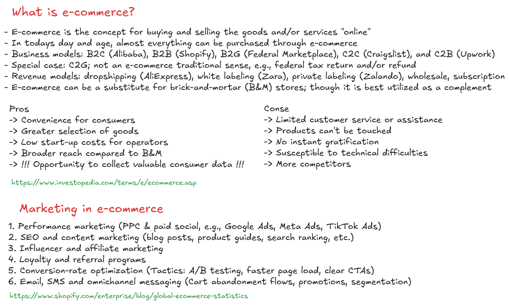
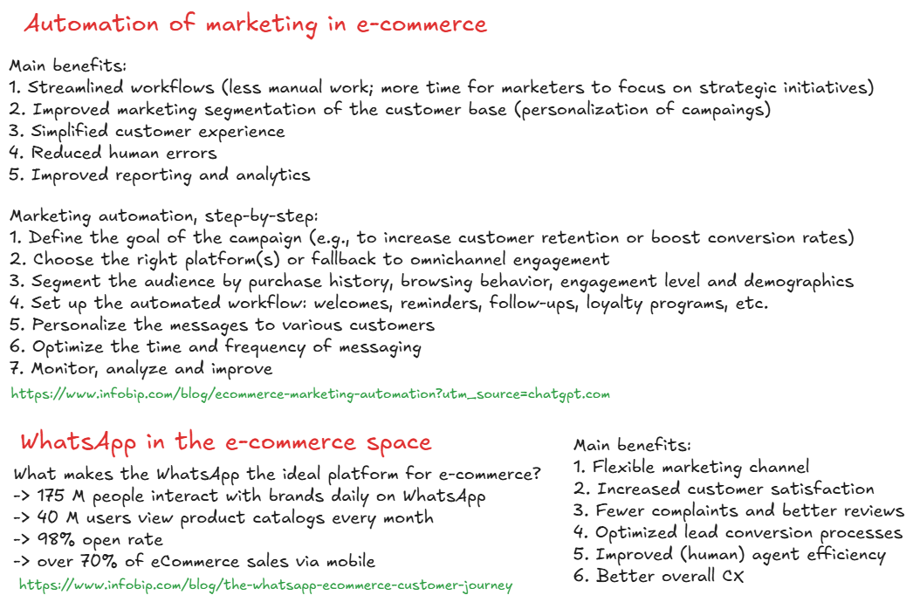
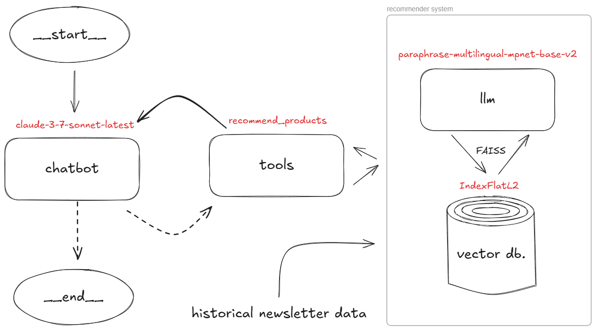

# Recruitment assignment

Original recruitment assignment for the senior AI research scientist position is available in the `material` subdirectory.

## Prerequisites

First install `uv` by Astral: https://docs.astral.sh/uv/getting-started/installation/.

Then, set up the project by cloning the remote repository on your local machine:

```bash
git clone https://github.com/akapet00/e-comm-assignment.git
```

Inside the local directory run:

```bash
uv sync .
```

This will set up the virtual environment (`.venv`) and install all the dependencies listed in `pyproject.toml`.


## Research scenario introduction (+ notes)
- e-commerce clients in South East Asia (possibly dealing with different regional languages)
- clients use telecommunication APIs to send mass-scale newsletters via e-mail
- each newsletter campaign reaches hundreds of thousands end-users, which may or may not interact with the products advertised in those campaigns
- some clients send newsletters with links to the products where you can track clicks, whereas other clients don’t (static catalogues)
- some of those clients (without trackable click system) need help to boost their revenue using the simple data

---



## Task (+ notes)
- build a conversational recommender system (e.g., as a WhatsApp chatbot) for up-selling and cross-selling of products that a specific client advertise 
- leverage the available historical newsletter data
- assume there is existing system available to deploy a conversational agent (e.g., a WhatsApp chatbot) and develop only the necessary APIs that take a textual input in and can return any kind of output (e.g., text, image, etc.)

---



## Methods

### Data extraction

**Extracting structured product metadata.** One simple approach to extract structured product metadata (e.g., product names, categories, prices, availability) and embedded URLs from historical e-mail newsletter messages is by using HTML parsing libraries to traverse the DOM and locate the targeted entries. Typically, production sections use `<div>` or `<article>` HTML blocks with identifiable classes or data attributes. Within each block, fields with CSS selectors or XPath such as the product name (often an `<h1>`/`<h2>` tag or a link text), price (by currency symbols like “¥” in Chinese locales), image URLs (``), and product URLs (`<a href="…">`) can be extracted. Additionally, schema.org or JSON-LD product markup embedded in the HTML could also be used.

Run:

```bash
In [1]: uv run extract_data.py
```

to see the data extraction in action by using the 4th edition of the [Beautiful Soup](https://www.crummy.com/software/BeautifulSoup/) library:

```bash
HTML content:

<html><body>
<div class="newsletter">
<div class="product">
    <h2 class="name">智能手机 (Smartphone XYZ)</h2>
    
    <span class="price">¥2999</span>
    <a href="http://example.com/product/123">View Product</a>
</div>
<div class="product">
    <h2 class="name">运动鞋 (Running Shoes ABC)</h2>
    
    <span class="price">¥499</span>
    <a href="http://example.com/product/456">View Product</a>
</div>
</div>
</body></html>
    

Extracted data:

[{'name': '智能手机 (Smartphone XYZ)',
  'price': '¥2999',
  'image_url': 'http://example.com/image1.jpg',
  'url': 'http://example.com/product/123'},
 {'name': '运动鞋 (Running Shoes ABC)',
  'price': '¥499',
  'image_url': 'http://example.com/image2.jpg',
  'url': 'http://example.com/product/456'}]
```

Additional parsing can also be done with the help of the regular expression or - as it's common thing to do nowadays - by copy-pasting the raw input to a LLM model allowing it do all its magic without too much intervention [[Sav2023](#Sav2023)].

**Extracting additional insights.** Historical campaign data on open rates and  rates (CTRs) can be used to infer popular product categories. For instance, product categories or keywords from past newsletters can be aggregated and clustered using topic modeling techniques (e.g., neural topic models [[Wu2024](#Wu2024)]) to uncover recurring themes. In the case of Chinese text, segmentation tools like [Jieba](https://github.com/messense/jieba-rs) should be applied prior to topic modeling. Additionally, clickstream data or user feedback logs can be analyzed to construct user profiles by tallying clicks or purchases per category. Old-school techniques such as tf-idf [[Spa72](#Spa72)] or transformer embeddings [[Vas2017](#Vas2017)] can then be applied to the newsletter content to align products with user interests. To detect trending topics, time-series analysis such as applying moving averages to product- or category-click counts can be used to identify whatever is currently "hot." All this derived data can in turn serve us as KPIs.

## Research foundation

**Product metadata extraction (semi-structured data).** Kumar et al. introduced context-aware visual attention (CoVA) for extracting product fields from e-commerce webpages [[Kum2022](#Kum2022)]. They treat each HTML element as an object and combine DOM structure with visual features via attention [[Vas2017](#Vas2017)]. By using the collected e-commerce dataset (with manually labeled product title, price, image elements), authors claim that CoVA outperforms classical DOM-based extractors significantly (by measuring gini impurity-based importance of features).

Similarly, but without using transformer-based architectures, Potta et al. extracted attribute values (e.g., color, size) from product descriptions by constructing a graph of token co-occurrences and applying graph neural networks (GNNs) [[Pot2024](#Pot2024)] to those attributes. Their GNN-based model showed significantly higher F1 than sequence tagging baselines.

Extending this direction, Zou et al. introduced a large open-source benchmark and dataset specifically focused on the more challenging task of implicit attribute value extraction, i.e., cases where attributes like material, fit, or style are not explicitly mentioned in product titles or descriptions but inferred from context (e.g., "perfect for winter" implying "thick" or "warm") [[Zou2024](#Zou2024)]. The benchmark includes 91k samples from diverse e-commerce categories and annotates both implicit and explicit values for 13 attributes. It also evaluates several LLMs (GPT-4, Claude, Gemini) and vision-language models (Gemini Pro Vision, GPT-4V, Claude 3 Sonnet) using prompt-based zero-shot and few-shot settings. Results show that even the strongest LLMs struggle with implicit cues, highlighting a significant gap in current systems’ ability to perform nuanced, multimodal reasoning. This work sets a new standard for evaluating product understanding in semi-structured settings and complements prior approaches by addressing a more subtle and semantically complex aspect of product metadata extraction.

**Topic modeling and user intent.** Rodrigues et al. used LLMs for topic/intent discovery by using the synthetic data where they expand a small set of user intents via hierarchical topic modeling and then prompt an LLM to generate synthetic utterances for each intent [[Rod2025](#Rod2025)]. Their results show that LLM-driven topic expansion created 278 intents (vs. 36 original) with coherent descriptions. Synthetic queries generated by GPT-style models improved few-shot intent classification. This highlights how LLM-based topic modeling can capture nuanced user intents even in sparse domains.

For multilingual contexts, especially involving Asian languages, some recent work has shown the limitations of general-purpose multilingual transformers and highlighted the need for region-specific adaptations. For example, Moghe et al. introduced MULTI3NLU++, a multi-domain, multi-intent dataset created by translating an English natural-language understanding (NLU) corpus into multiple languages (excluding Chinese), revealing that models like mBERT and XLM-R struggle with low-resource language generalization [[Mog2023](#Mog2023)].Conversely, for Chinese topic modeling and intent detection, recent state-of-the-art approaches increasingly rely on Chinese-specific pretrained models like [ERNIE 4.0](https://aimode.co/model/ernie-4/), a fourth iteration of the ERNIE generative AI model developed by the Chinese search giant, Baidu, and is designed to be a more powerful and capable natural language generation model.

In applied settings, models like [BERTopic](https://maartengr.github.io/BERTopic/index.html) have been successfully adapted to Chinese by leveraging sentence-transformer variants such as [uer/sbert-base-chinese-nli](https://huggingface.co/uer/sbert-base-chinese-nli). So for our use case we would either leverage Chinese-specific models (ERNIE, [ChatGLM](https://chatglm.cn/main/alltoolsdetail?lang=en)) or multilingual ones ([mBERT](https://github.com/google-research/bert/blob/master/multilingual.md)) trained on Chinese corpora. Simple demonstration of embedding-based recommender using uer/sbert-base-chinese-nli is available by running the following command in the `src` subdirectory:

```bash
In [2]: uv run recommend_embedding.py
```

```bash
Out[2]:

User interests: ['智能手机', '耳机']

Set of advertised products: ['智能手机 (Smartphone XYZ)', '运动鞋 (Running Shoes ABC)']

Recommendations based on product-product similarity: {'智能手机 (Smartphone XYZ)'}
```

Here, we utilize a pre-trained Chinese embedding model with a state-of-the-at retrieval index (e.g., [FAISS](https://ai.meta.com/tools/faiss/)) to find nearest neighbors to the user’s query vector. Note that the set of advertised product is extracted automatically via the `extract_data.py` script.

In traditional settings, the latent Dirichlet analysis on jieba-tokenized text was often used in topic modeling. Simple demonstration of such an approach with `scikit-learn` is available by running:

```bash
In [3]: uv run recommend_basic.py
```

```bash
Out[3]:

User interests: ['智能手机', '耳机']

Set of advertised products: ['智能手机 (Smartphone XYZ)', '运动鞋 (Running Shoes ABC)']

Recommendations based on product-product similarity: {'智能手机 (Smartphone XYZ)'}
```

In this example, we fit a simple character-level vectorizer (as we opted not to used any special tokenization). Then, a similarity matrix is constructed by computing cosine similarity between each sample of user preferences and advertised products. Cosine similarity, or the cosine kernel, computes similarity as the normalized dot product of two vectors, say $\vec X$ and $\vec Y$, as: $ \langle \vec X, \vec Y \rangle / (\| \vec X \| \times \vec Y \|)$. On L2-normalized data, this function is equivalent to the linear_kernel. Finally, for each advertised product, we check if it matches any interest above certain predefined threshold.

**Multilingual NLP and conversational recommender systems.** Liu et al. combined conversational recommender systems (CRS) with LLMs in e-commerce dialogues [[Liu2023](#Liu2023)]. While pure CRSs learn user preferences to recommend, they have limited language generation. On the other hand, LLMs generate fluent dialogue but lack domain knowledge. Authors propose two hybrid modes: "LLM assists CRS" (LLM generates candidate utterances) and "CRS assists LLM" (recommender feeds item IDs into LLM prompts). They show both collaborations can improve recommendation accuracy in pre-sales chats.

More broadly, recent surveys note a trend of using large pre-trained LMs (GPT, ChatGPT, Claude) to augment or endow recommenders with language understanding and generation [[Jan2023](#Jan2023)]. For multilingual scenarios, models like ChatGLM (Chinese-centric) or Google’s multilingual PaLM help handle Chinese queries and product descriptions. Frameworks such as LangChain or LangGraph can orchestrate LLM prompts, retrieval (via vector stores or KBs), and other pipelines in a chatbot. 

## Architectural proposal

- What specific components (e.g., Data pipelines, NLP extraction methods, embedding models, generative AI models, recommendation algorithms) are necessary?
- Which NLP tools or models are suitable for multilingual processing, particularly for Chinese? 
- How will the data extraction system integrate with a generative conversational recommender system (recommendation logic, personalization capabilities, 
conversational flow)?

TBA.

## Evaluation and metrics

**Metadata extraction.** The simplest approach is to evaluate parsed fields against a gold standard (manually labeled subset of newsletters). Traditionally, evaluation metrics such as precision, recall, and F1 core are used for each field (name, price, etc.):
- Precision. The ratio of correctly extracted instances to the total extracted instances.
- Recall. The ratio of correctly extracted instances to the total relevant instances in the gold standard.
- F1 score. The harmonic mean of precision and recall.

**Recommendation performance.** Online metrics (via A/B tests or historical logs) such as CTRs and conversion rates (CRs) can be tracked on recommended items. Offline, the precision@k and recall@k on held-out interaction data can be measured. Fore example, if a user clicked an item, did the top-K list contain that item? Also additional consideration such as diversity or coverage metrics, customer satisfaction, etc. for multi-lingual balance could be measured.

**Conversational Relevance.** For the chatbot, the best thing is to evaluate the response quality. Common automatic metrics are BLEU (short for bilingual evaluation understudy) [[Pap2002](#Pap2002)] and ROUGE (short for recall-oriented understudy for gisting evaluation) [[Lin2004](#Lin2004)] scores which measure of overlap between the system-generated responses and reference responses using n-gram precision in slightly different way (though both are not well-suited for conversational recommender models [[Jan2023](#Jan2023)]). Regarding the manual evaluation, well-trained/native speaker judge could assess whether the chatbot’s recommendations are relevant, coherent, and in appropriate tone. Additionally, Likert scales (in psychometrics, a response scale frequently used in questionnaires to measure attitudes, perceptions, or beliefs) could be utilized in order to assess the fluency, usefulness, and intent recognition accuracy.

**Overall system.** Business KPIs like email engagement lift (e.g., did personalization increase newsletter click rates?) and chatbot engagement (e.g. how many sessions per user were there?) should be tracked. Log conversational feedback (e.g. user thumbs up/down, useful/not useful) can be collected to refine recommendations and improve upon the language models and/or agent chatbots.

## Showcase

Check out the `prototype` subdirectory. Within, there are two notebooks: `simple.ipynb` and `full.ipynb`.

The first one is hand coded and it contains a very simple agentic AI chatbot. The chatbot has the possibility of retrieving historical data on newsletters. It also understands the user intent and has memory to provide better service and maximize the likelihood of selling the advertised products. Its architecture consists of the several components:

---



The second prototype is "vibe coded" with the help of Claude Sonnet 4 by Anthropic, and, [as advertised](https://www.anthropic.com/news/claude-4), it truly excels at all coding tasks I tried it on. It is accessed through Cline, [the collaborative AI coder](https://cline.bot/), in Visual Studio Code.

---

⚠️ **NOTE** ⚠️

To run the Anthropic's large language model (LLM) from within the LangChain (provided in the prototype) as:

```python
from langchain.chat_models import init_chat_model

llm = init_chat_model("anthropic:claude-3-7-sonnet-latest")
```

the Anthropic API key should be exported as the environment variable.

The easiest (and most secure) way is to expose the API key in the `.env` file:

```
ANTHROPIC_API_KEY = "sk-ant-..."
```

Then the `.env` file can be parsed and, by using the `dotenv` Python library, `ANTHROPIC_API_KEY` is added to the environment variables list during the run time:

```python
from dotenv import load_dotenv

load_dotenv()
```

Otherwise, the instantiation of the LLM can be rewritten as:

```python
from langchain_anthropic import ChatAnthropic

llm = ChatAnthropic(
    model="claude-3-7-sonnet-latest",
    api_key="sk-ant-..."
)
```

where the API key is defined explicitly.

The API key will be provided on demand: mailto:akapet00@gmail.com

---

## References

[<a id="Sav2023">Sav2023</a>] &emsp; Savelka J. and Ashley KD. The unreasonable effectiveness of large language models in zero-shot semantic annotation of legal texts. Frontiers in Artificial Intelligence. 6:1279794 (2023.) https://doi.org/10.3389/frai.2023.1279794


[<a id="Wu2024">Wu2024</a>] &emsp; Wu, X., Nguyen, T., and Luu, A.T. A survey on neural topic models: Methods, applications, and challenges. Artificial Intelligence Review 57, 18. (2024). https://doi.org/10.1007/s10462-023-10661-7

[<a id="Spa72">Spa72</a>] &emsp; Spärck Jones, K. A statistical interpretation of term specificity and its application in retrieval". Journal of Documentation. 28, 1 (1972). https://doi.org/10.1108/eb026526

[<a id="Vas2017">Vas2017</a>] &emsp; Vaswani, A., Shazeer, N., Parmar, N., Uszkoreit, J., Jones, L., Gomez, A. N., Kaiser, Ł., and Polosukhin, I. Attention is all you need. Proceedings of the 31st International Conference on Neural Information Processing Systems. (2017). https://dl.acm.org/doi/10.5555/3295222.3295349

[<a id="Kum2022">Kum2022</a>] &emsp; Kumar, V., Ghosh, S., Jain, A., and Talukdar, P. CoVA: Context-aware visual attention for webpage information extraction. Proceedings of the Fifth Workshop on e-Commerce and NLP (ECNLP 5). (2022). https://doi.org/10.18653/v1/2022.ecnlp-1.11

[<a id="Pot2024">Pot2024</a>] &emsp; Potta, V., Krishna, S., and Saini, R. AttriSage: Product attribute value extraction using graph neural networks. Proceedings of the 18th Conference of the European Chapter of the Association for Computational Linguistics: Student Research Workshop (2024). https://aclanthology.org/2024.eacl-srw.8/

[<a id="Zou2024">Zou2024</a>] &emsp; Zou, H., Samuel, V., Zhou, Y., Zhang, W., Fang, L., Song, Z., Yu, P., and Caragea, C. ImplicitAVE: An open-source dataset and multimodal LLMs benchmark for implicit attribute value extraction. Findings of the Association for Computational Linguistics: ACL 2024. (2024). https://doi.org/10.18653/v1/2024.findings-acl.20

[<a id="Rod2025">Rod2025</a>] &emsp; Rodrigues, K., Hegazy, M., J., and Naeem, A. Topic and intent discovery from sparse data with LLM-augmented synthetic utterances. (2025). https://doi.org/10.48550/arXiv.2505.11176

[<a id="Mog2023">Mog2023</a>] &emsp; Moghe, A., Agarwal, D., and Singh, S. Multi3NLU++: A multilingual, multi-intent, multi-domain dataset for natural language understanding in task-oriented dialogue. Findings of the Association for Computational Linguistics: ACL 2023. (2023). https://doi.org/10.18653/v1/2023.findings-acl.230


[<a id="Liu2023">Liu2023</a>] &emsp; Liu, Y., Zhang, W. Chen, Y., Zhang, Y., Bai, H., Feng, F., Cui, H., Li, Y. and Che. W. Conversational recommender system and large language model are made for each other in e-commerce pre-sales dialogue. Findings of the Association for Computational Linguistics: EMNLP 2023. (2023.) https://doi.org/10.18653/v1/2023.findings-emnlp.643

[<a id="Jan2023">Jan2023</a>] &emsp; Jannach, D. Evaluating conversational recommender systems. Artificial Intelligence Review 56. (2023). https://doi.org/10.1007/s10462-022-10229-x

[<a id="Pap2002">Pap2002</a>] &emsp; Papineni, K., Roukos, S., Ward, T., and Zhu, W-J. BLEU: A method for automatic evaluation of machine translation. Proceedings of the 40th Annual Meeting of the Association for Computational Linguistics: ACL 2002. (2002.) https://dl.acm.org/doi/10.3115/1073083.1073135

[<a id="Lin2004">Lin2004</a>] &emsp; Lin, C-Y. ROUGE: A package for automatic evaluation of summaries. Proceedings of the Text Summarization Branches Out (ACL). (2004.) https://aclanthology.org/W04-1013/